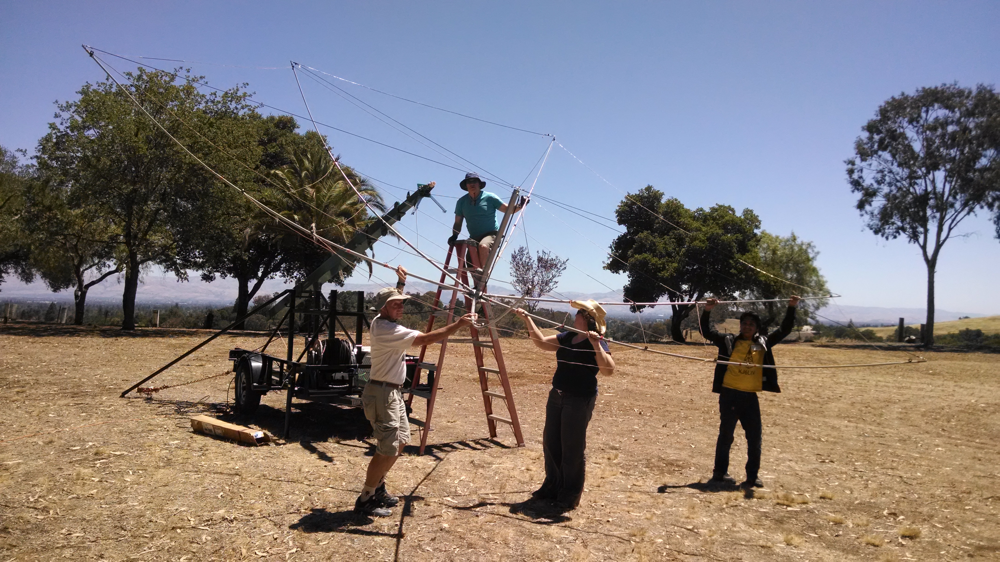
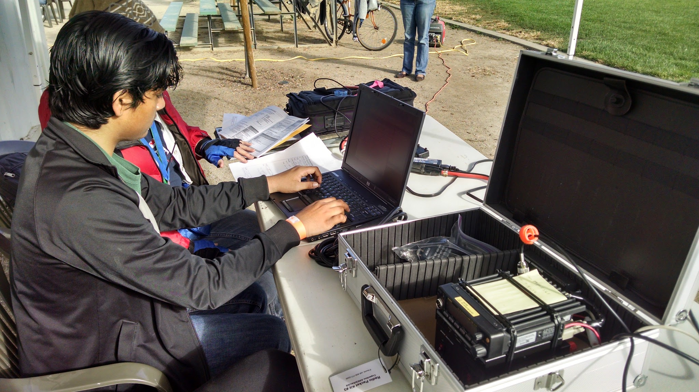
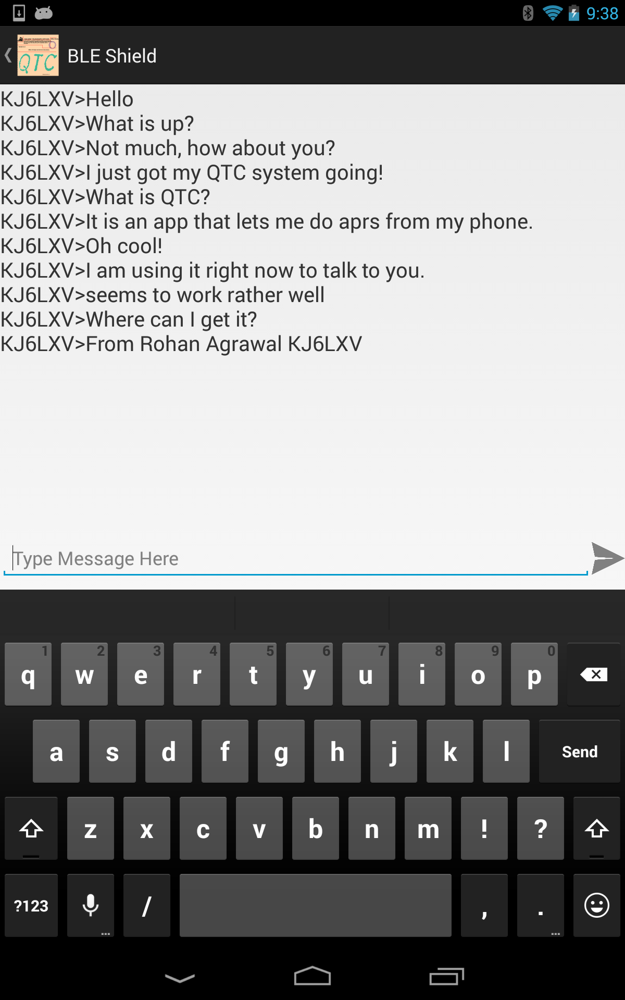

:title: RCA Breakfast
:author: Rohan Agrawal
:description: Presentation for RCA Breakfast@IWCE2016
:css: presentation.css

This uses hovercraft

----

:id: rohan-agrawal
:class: title-step

:hovercraft-path: M 244.33315,446.99882 C 260.84654,420.31092 294.39935,402.58403 325.70084,411.36299 347.13547,417.01978 367.15061,435.26442 368.0023,458.47539 369.82857,474.70986 370.44782,492.72044 361.70175,507.15626 353.08694,521.97842 326.56164,531.87968 312.287,531.28142 305.75136,536.89558 308.64594,541.19285 307.94001,543.83643 L 307.47331,582.56956

Rohan Agrawal
=============

KJ6LXV
--------

.. note::

	Good morning everybody, I am Rohan Kj6LXV. Let me start off saying thanks RCA and IWCE for allowing me attend this conference. I am generally not allowed to attend such conferences because of my age. Whether its because insurance reasons or there is alcohol served on the premises. So I am really excited to be here today. And of course. what a great reason to skip school:-)

----

:data-rotate-x: 50

.. image:: img/104.JPG
	:width: 400px

.. note::
	I got my license when I was 9 years old, as the first ham in my family. I still remember the day when I got my technician license and the day we install our first antenna. Ever since then, I have been involved in local ham clubs, field days, and talking on the local repeaters. Through this involvement I was able to explore and expand my electronics knowledge with the guidance of experience people.

----

.. note::
	Putting up hexbeam on Field Day

----

:id: people-met

.. image:: img/DSC_0033.JPG
	:width: 400px

.. image:: img/DSC_0258.JPG
	:width: 400px
	:class: right

.. image:: img/DSC_0161.JPG
	:width: 400px

.. image:: img/DSC_0046.JPG
	:width: 400px
	:class: right

.. note::
	
	Carole:
	Pacificon 
	Dayton 
	RCA 
	(6th event)

	meet and talk to many amazing people who has achieved excellence in their field.

	Frank Drake, SETI

	Bob Heil, Heil

	Bob Bruninga, APRS

	David Leeson, California Microwave

----

:data-rotate-x: 00
:data-rotate-y: 50

:id: texting-without-bars
:class: title-step

Texting Without Bars
====================

Rohan Agrawal
-------------

.. note::

	Project worked on for a few years: presented at RCA Technical Symposium

    Technology has transformed the way that we communicate, it allows us to connect across the world nearly instantly. Ham Radio was pivotal during the early days of worldwide communication, but it has rapidly fallen behind the ways in which people,especially youth, actually talk. 

----

.. image:: img/texting.jpg
	:width: 600px

.. note::
	I say talk, but rarely is it actually talking, like it or not text (and emoji) based messaging has overtaken voice as the main use for our cell phones. 

----

.. note::
	CARES Packet Drill

	Now there exist digital/text modes for ham radio, however many of them such as Packet and PSK31 usually require a bulky setup with a laptop, and expensive equipment. And most of the software that exists for these setups is unintuitive and difficult to use.

----

:class: title-step

ODIN
====

.. note::
	With smartphones however, it is possible to create a simple and elegant messaging experience, as shown by the myriad of apps that do this over the  internet. That's when I decided to make Odin, which acts as a bridge between the world of ham radio and the world of consumer electronics such as smartphones.

----

.. image:: img/serial.gif
	:width: 500px

.. note::
	After setting out to make Odin a reality, I quickly realized a few hurdles in interconnecting smartphones and radios. Namely, that ham radio, and embedded electronics, both love serial. Smartphones, and even most laptops decidedly do not. You would have trouble finding a modern piece of consumer electronics with an exposed, accessible serial port on it. 

----

.. image:: img/bluetooth.png
	:width: 400px

.. note::
	I looked at all my options to connect to a smartphone (not very many) and decided to go with Bluetooth. Specifically Bluetooth Low Energy, or BLE. BLE has many advantages over other connectivity options for smartphones, no infrastructure (unlike Wifi), low cost implementation (unlike Classic Bluetooth and Wifi), and wirelessness. In order to make using Odin simpler, I decided that there should not be a need for a wire between the smartphone and any hardware I would make.

----

.. image:: img/Explositon.png
	:width: 800px

.. note::
	Original Prototype

	3 Boards

	Chose APRS/Packet Radio, 
		used on VHF,
		high data rates

----

.. image:: img/Odin_new.png
	:width: 800px

.. note::
	Enclosed

	Front Panel

	1AA

	Kenwood/Baofeng, but making cables for others

----

.. image:: img/3d_board.png
	:width: 600px

.. note::
	Justin Mitchell, Chip Cohen from Fractal Antennas helped with the VNA

----

.. image:: img/box2.png
	:width: 800px

----

----

:id: overview
:data-x: 5000
:data-y: 5000
:data-z: 3500
:data-rotate: 0
:data-rotate-x: 0
:data-rotate-y: 0
:data-scale: 24

----

:class: title-step
:data-scale: 1
:data-x: 4700
:data-y: 11000

Thank you!
==========

rohan@aleopile.com

linkedin.com/in/rohbotics