:title: RCA Breakfast
:author: Rohan Agrawal
:description: Presentation for RCA Breakfast@IWCE2016
:css: presentation.css

This uses hovercraft

----

:id: rohan-agrawal
:class: title-step

:hovercraft-path: M 296.5979,487.83217 C 302.68993,478.67818 313.68212,480.68862 316.39332,487.83217 317.18283,491.91803 317.1513,497.09067 314.62301,498.62438 312.58979,500.74543 310.43343,501.02642 309.15825,501.88406 L 309.06237,509.84153

Rohan Agrawal
=============

KJ6LXV
--------

.. note::

    Welcome to the presenter console!

----

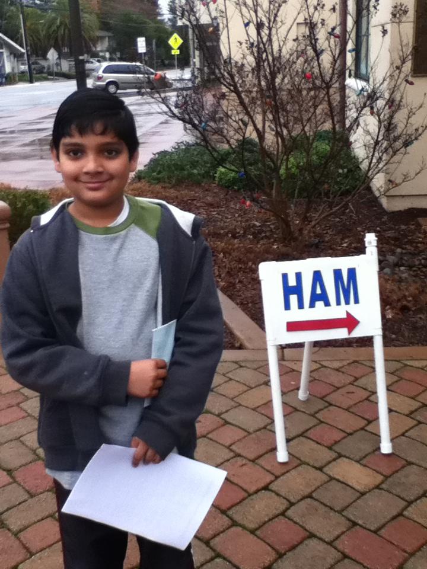

.. note::
	Me getting my Tech license in 2009

----

:id: people-met

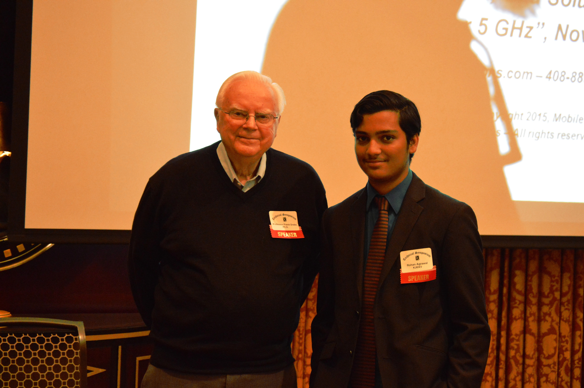

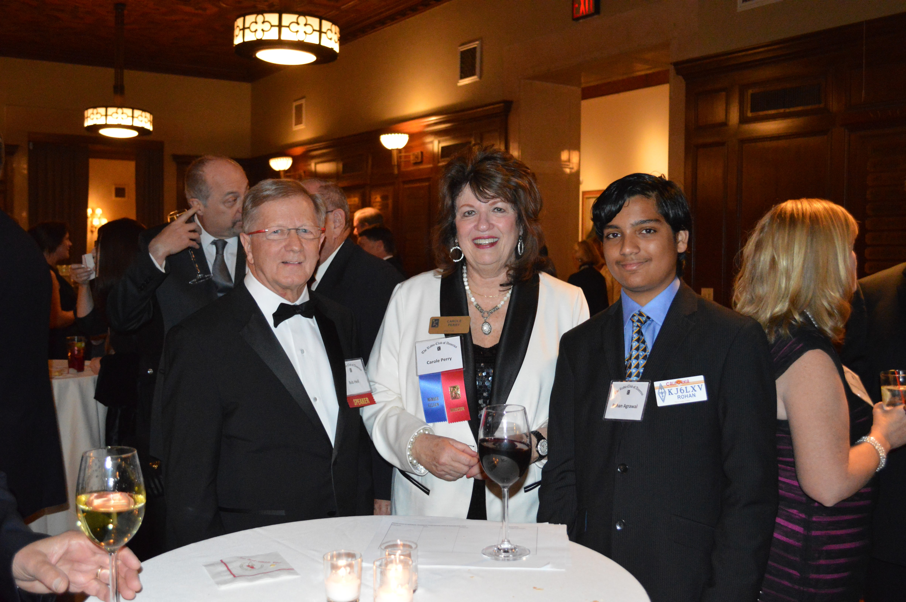

.. image:: img/DSC_0161.JPG
	:width: 400px

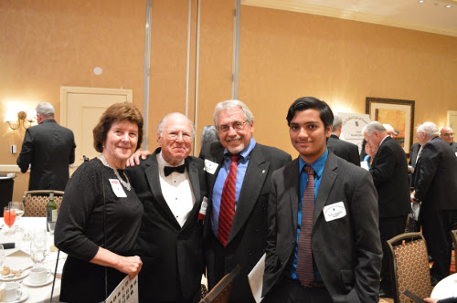

.. note::
	
	Frank Drake, SETI

	Bob Heil, Heil

	Bob Bruninga, APRS

	David Leeson, California Microwave

----

:id: texting-without-bars
:class: title-step

Texting Without Bars
====================

Rohan Agrawal
-------------

.. note::

    Welcome to the presenter console!

----

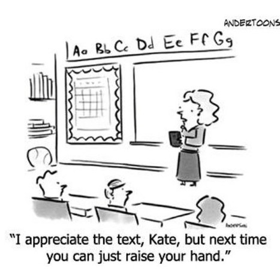

----

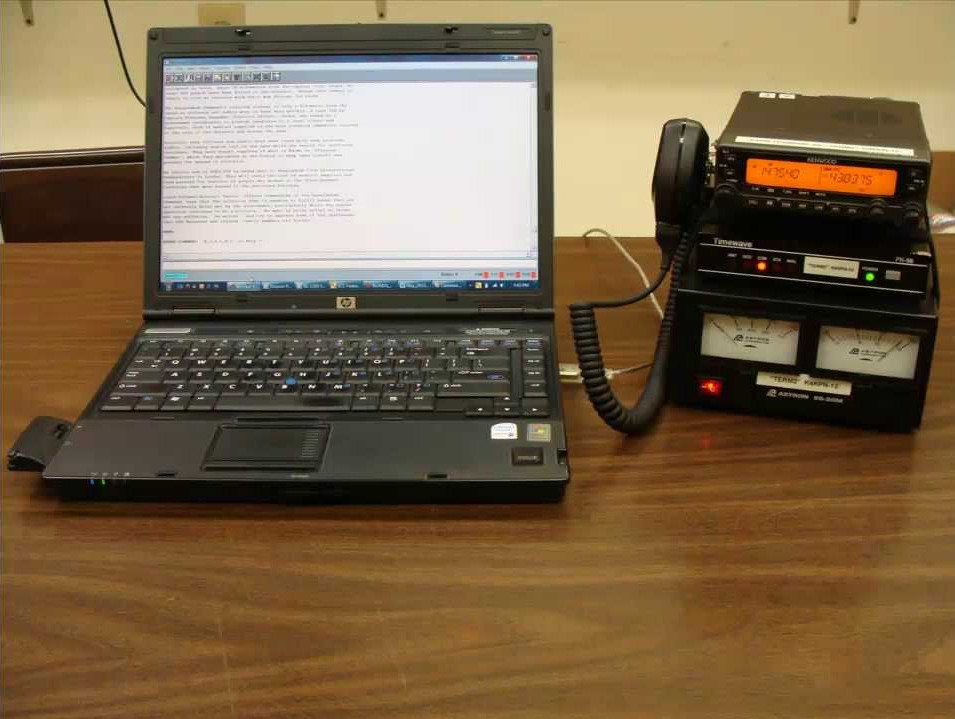

----

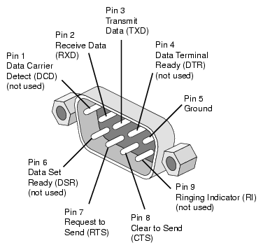

----

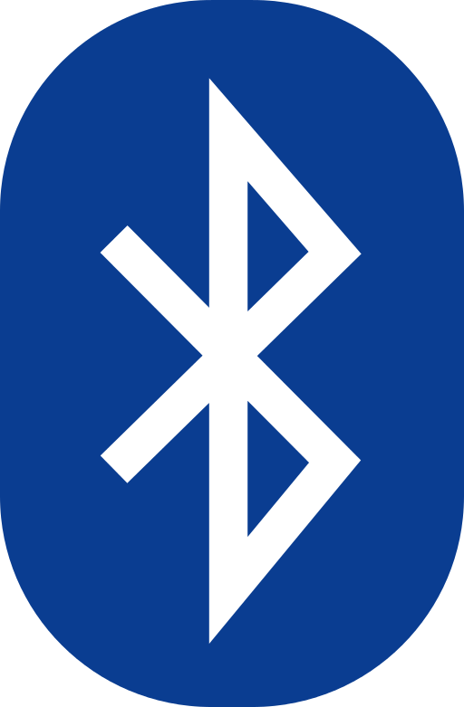

----

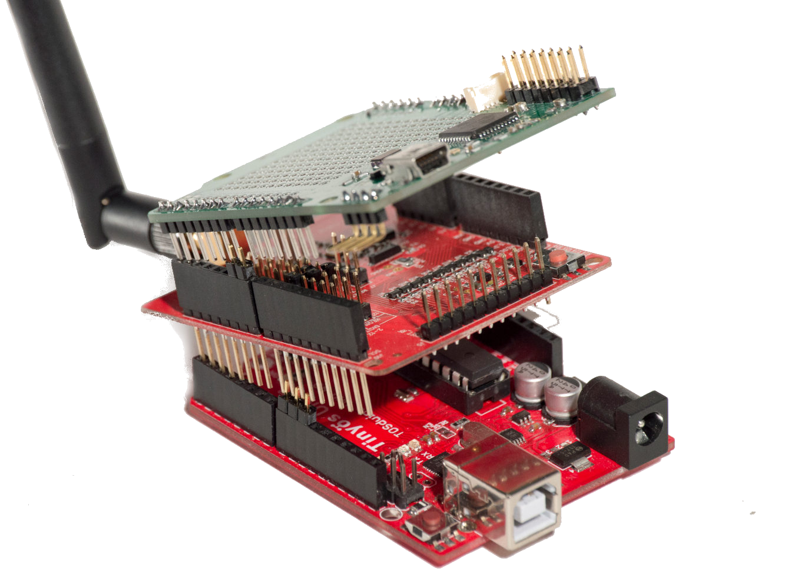

----

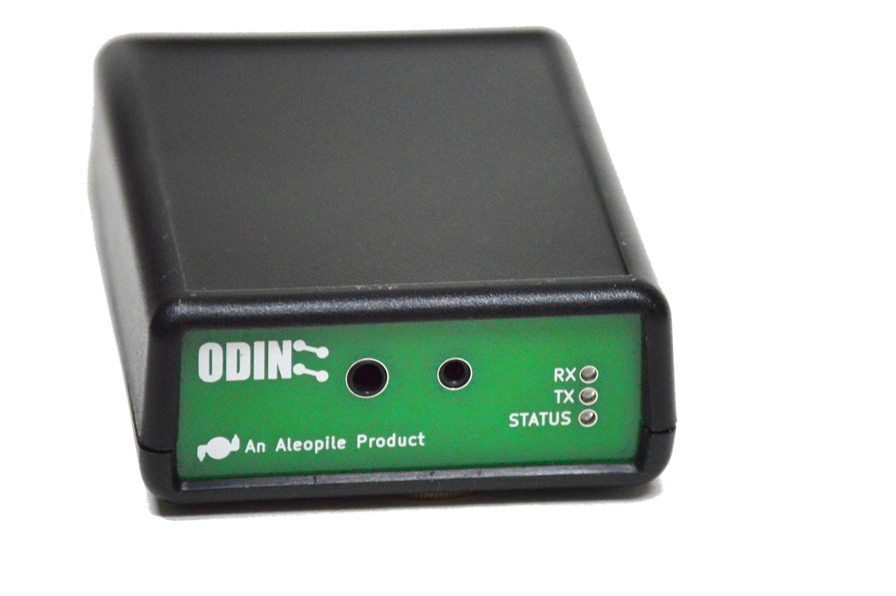

----

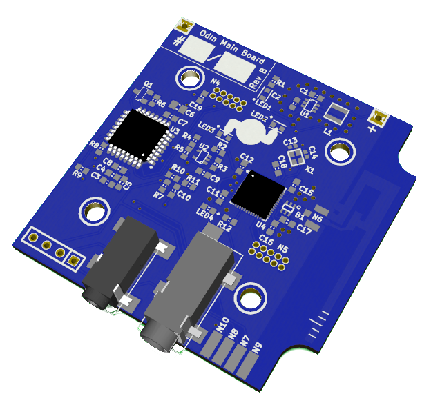

.. note::
	Challenges:
	Alignment
	Antenna

	Justin Mitchell, Chip Cohen from Fractal Antennas helped with the VNA

----

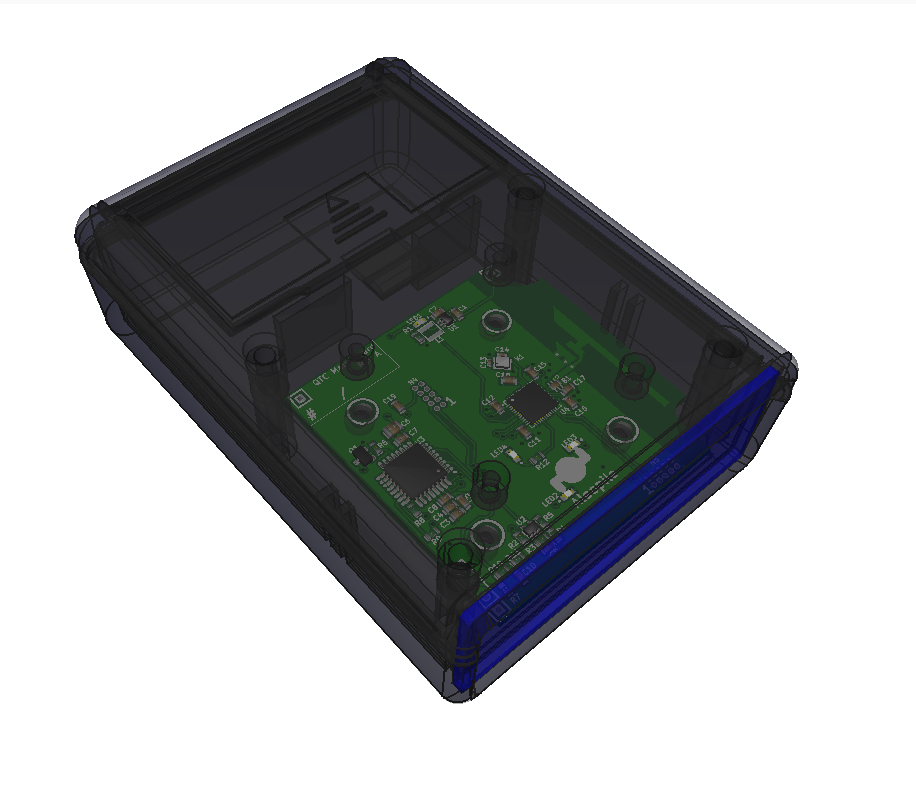

----

:id: overview
:data-x: 5000
:data-y: 5000
:data-z: 1000
:data-rotate: 0
:data-rotate-x: 0
:data-rotate-y: 0
:data-scale: 20

----

:class: title-step
:data-scale: 1
:data-x: 0000
:data-y: 1000

Thank you!
==========

rohan@aleopile.com
linkedin.com/in/rohbotics