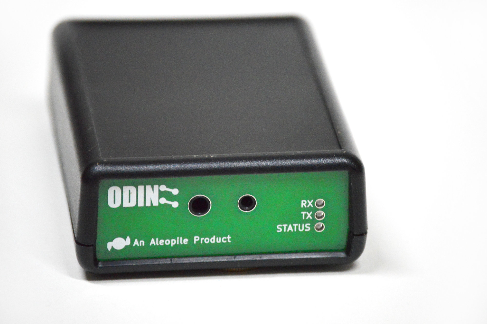

:title: RCA Breakfast
:author: Rohan Agrawal
:description: Presentation for RCA Breakfast@IWCE2016
:css: presentation.css

This uses hovercraft

----

:id: rohan-agrawal
:class: title-step

Rohan Agrawal
=============

KJ6LXV
--------

.. note::

    Welcome to the presenter console!

----

----

:id: people-met

.. image:: img/DSC_0258.JPG
	:width: 400px
	:class: right

.. image:: img/DSC_0161.JPG
	:width: 400px

.. image:: img/DSC_0046.JPG
	:width: 400px
	:class: right

.. note::
	
	Frank Drake, SETI

	Bob Heil, Heil

	Bob Bruninga, APRS

	David Leeson, California Microwave

----

:id: texting-without-bars
:class: title-step

Texting Without Bars
====================

Rohan Agrawal
-------------

.. note::

    Welcome to the presenter console!

----

.. image:: img/texting.jpg
	:width: 600px	

----

.. image:: img/packet-setup.jpg
	:width: 800px	

----

.. image:: img/serial.gif
	:width: 500px

----

----

----

----

----

But then there was Prezi
========================

Sliding from left to right is no longer enough.
You need to be able to...

.. note::

    If you click on the timer it restarts from zero. This is handy when you
    are rehearsing the presentation and need to make sure it fits in the time
    allocated.

----

:data-y: r1000

...pan...
=========

.. note::

    If you have more notes than fit in the console, you can scroll down, but
    more handily, you can scroll the text up by pressing space bar.

----

:data-rotate: 90

...rotate...
============

.. note::

   If there isn't more text to scroll up, space bar will go to the next
   slide. Therefore you, as a presenter, just press space every time you run
   out of things to say!

----

:id: overview
:data-x: 5000
:data-y: 0
:data-z: 1000
:data-rotate: 0
:data-scale: 10